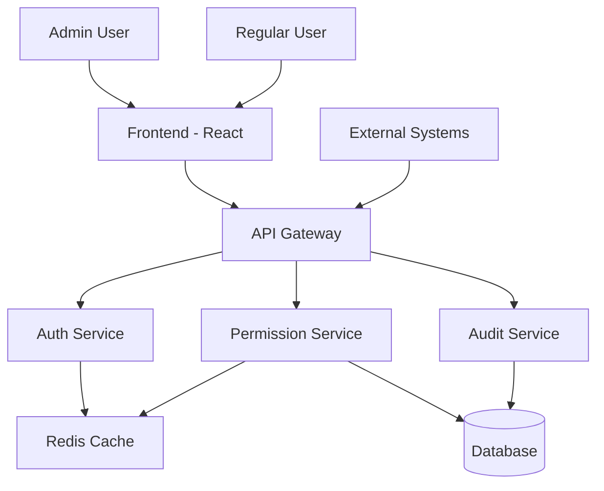

# Comprehensive Role and Permission Management System Design

## 1. Enhanced Database Schema

### Current Schema Issues
- RolePermissions table lacks granularity (only links roles to modules)
- No audit trail for permission changes
- Limited performance optimizations

### Proposed Schema Enhancements

#### Updated RolePermissions Table
```sql
model RolePermissions {
  role_permissions_id Int      @id @default(autoincrement())
  user_type_id         Int
  admin_module_id      Int
  permissions          Json     // ["view", "create", "edit", "delete"]
  created_date         DateTime @default(now())
  last_updated_date    DateTime @updatedAt
  is_active            Boolean  @default(true)

  user_type            UserType     @relation(fields: [user_type_id], references: [user_type_id])
  admin_module         AdminModules @relation(fields: [admin_module_id], references: [admin_module_id])

  @@map("role_permissions")
}
```

#### New PermissionAudit Table
```sql
model PermissionAudit {
  audit_id         Int      @id @default(autoincrement())
  user_type_id     Int?
  admin_module_id  Int?
  user_id          Int?     // Who made the change
  action           String   // "create", "update", "delete", "assign", "revoke"
  old_permissions  Json?
  new_permissions  Json?
  change_reason    String?
  ip_address       String?
  user_agent       String?
  timestamp        DateTime @default(now())

  user_type        UserType?     @relation(fields: [user_type_id], references: [user_type_id])
  admin_module     AdminModules? @relation(fields: [admin_module_id], references: [admin_module_id])
  user             User?         @relation(fields: [user_id], references: [user_id])

  @@map("permission_audit")
}
```

#### New PermissionCache Table (for performance)
```sql
model PermissionCache {
  cache_id      Int      @id @default(autoincrement())
  user_id       Int
  module_id     Int
  permissions   Json
  cached_at     DateTime @default(now())
  expires_at    DateTime

  user          User         @relation(fields: [user_id], references: [user_id])
  module        AdminModules @relation(fields: [module_id], references: [admin_module_id])

  @@unique([user_id, module_id])
  @@map("permission_cache")
}
```

#### Indexes for Performance
```sql
-- RolePermissions
CREATE INDEX idx_role_permissions_user_type ON role_permissions(user_type_id);
CREATE INDEX idx_role_permissions_module ON role_permissions(admin_module_id);
CREATE INDEX idx_role_permissions_active ON role_permissions(is_active);

-- PermissionAudit
CREATE INDEX idx_permission_audit_timestamp ON permission_audit(timestamp);
CREATE INDEX idx_permission_audit_user_type ON permission_audit(user_type_id);
CREATE INDEX idx_permission_audit_user ON permission_audit(user_id);

-- PermissionCache
CREATE INDEX idx_permission_cache_user ON permission_cache(user_id);
CREATE INDEX idx_permission_cache_expires ON permission_cache(expires_at);
```

## 2. Backend API Design

### Permission Actions Enum
```javascript
const PERMISSION_ACTIONS = {
  VIEW: 'view',
  CREATE: 'create',
  EDIT: 'edit',
  DELETE: 'delete'
};
```

### Enhanced Models

#### RolePermissions Model Updates
- Add validation for permissions array
- Add methods for checking specific permissions
- Add bulk operations

#### New PermissionAudit Model
- Methods for logging permission changes
- Query methods for audit trails

#### New PermissionService
- Resolve user permissions (role + user overrides)
- Cache management
- Bulk permission operations

### API Endpoints

#### Role Permissions
```
GET    /api/roles/:roleId/permissions          # Get permissions for role
PUT    /api/roles/:roleId/permissions          # Update role permissions
POST   /api/roles/:roleId/permissions/bulk     # Bulk assign permissions
DELETE /api/roles/:roleId/permissions/:moduleId # Remove module permissions
```

#### User Permissions
```
GET    /api/users/:userId/permissions          # Get effective permissions
PUT    /api/users/:userId/permissions          # Override user permissions
DELETE /api/users/:userId/permissions/:moduleId # Remove user override
```

#### Audit
```
GET    /api/audit/permissions                   # Get permission audit log
GET    /api/audit/permissions/:userId           # Get audit for user
POST   /api/audit/permissions/search            # Search audit logs
```

#### Advanced Features
```
GET    /api/permissions/modules/:moduleId/roles # Get roles with access to module
GET    /api/permissions/users/:action           # Get users with specific action
POST   /api/permissions/validate                # Validate permission structure
```

### Middleware Enhancements

#### Enhanced RBAC Middleware
```javascript
const checkPermission = (module, action) => {
  return async (req, res, next) => {
    const userPermissions = await permissionService.getUserPermissions(req.user.user_id);

    if (userPermissions[module]?.includes(action)) {
      return next();
    }

    return res.status(403).json({ message: 'Insufficient permissions' });
  };
};
```

#### Audit Middleware
```javascript
const auditPermissionChanges = async (req, res, next) => {
  const originalSend = res.send;
  res.send = function(data) {
    // Log permission changes
    if (req.method !== 'GET' && req.url.includes('/permissions')) {
      await auditService.logPermissionChange({
        user_id: req.user?.user_id,
        action: req.method,
        details: req.body,
        ip: req.ip,
        userAgent: req.get('User-Agent')
      });
    }
    originalSend.call(this, data);
  };
  next();
};
```

## 3. Frontend Architecture

### Component Structure
```
src/features/Permissions/
├── components/
│   ├── PermissionMatrix.tsx          # Main permission management UI
│   ├── RolePermissionEditor.tsx      # Edit permissions for a role
│   ├── UserPermissionOverride.tsx    # User-specific overrides
│   ├── PermissionAuditLog.tsx        # Audit trail viewer
│   ├── BulkPermissionActions.tsx     # Bulk operations UI
│   └── PermissionTemplates.tsx       # Predefined permission sets
├── hooks/
│   ├── usePermissions.ts             # Permission state management
│   ├── usePermissionAudit.ts         # Audit log hooks
│   └── useBulkPermissions.ts         # Bulk operations
├── types/
│   ├── permission.types.ts           # TypeScript interfaces
│   └── audit.types.ts
├── utils/
│   ├── permissionValidation.ts       # Client-side validation
│   └── permissionHelpers.ts          # Utility functions
└── apis/
    ├── permissionApi.ts              # API calls
    └── auditApi.ts
```

### State Management
```typescript
interface PermissionState {
  roles: Role[];
  modules: Module[];
  rolePermissions: Record<string, Permission[]>;
  userOverrides: Record<string, Permission[]>;
  auditLogs: AuditLog[];
  loading: boolean;
  error: string | null;
}

interface Permission {
  moduleId: number;
  actions: ('view' | 'create' | 'edit' | 'delete')[];
}
```

### Key Components

#### PermissionMatrix Component
- Grid showing roles vs modules
- Checkboxes for each action
- Bulk selection controls
- Real-time validation

#### RolePermissionEditor
- Modal for editing role permissions
- Module tree with action checkboxes
- Permission templates
- Change preview

#### AuditLogViewer
- Paginated audit log
- Filtering by user, module, date
- Export capabilities

## 4. Integration Points

### Backend-Frontend Integration
- RESTful API with consistent response formats
- WebSocket for real-time permission updates (optional)
- Proper error handling and loading states

### Authentication Integration
- JWT tokens include user permissions in payload
- Refresh token mechanism updates permissions
- Logout clears permission cache

### Caching Strategy
- Redis for server-side permission cache
- LocalStorage for client-side cache
- Cache invalidation on permission changes

## 5. Security Considerations

### Input Validation
- Server-side validation of permission arrays
- Sanitization of audit log inputs
- Rate limiting on permission change endpoints

### Authorization
- Superadmin-only access to permission management
- Principle of least privilege
- No permission elevation through API

### Audit Logging
- All permission changes logged
- Immutable audit trail
- Compliance with data retention policies

### Data Protection
- Encryption of sensitive audit data
- Secure API keys for external services
- HTTPS-only communication

## 6. Performance Optimizations

### Database Optimizations
- Composite indexes on frequently queried columns
- Query result caching
- Connection pooling

### Caching Strategy
- Permission cache with TTL
- Cache warming on application startup
- Cache invalidation webhooks

### API Optimizations
- Pagination for large datasets
- Eager loading of related data
- Response compression

### Frontend Optimizations
- Virtual scrolling for large permission matrices
- Debounced API calls
- Optimistic updates

## 7. Migration Strategy

### Phase 1: Database Migration
1. Add new columns to existing tables
2. Create new audit table
3. Populate default permissions (view for existing role-module links)
4. Create database migration scripts

### Phase 2: Backend Migration
1. Update models with new schema
2. Implement new services and middleware
3. Update existing endpoints
4. Add new API endpoints

### Phase 3: Frontend Migration
1. Update components for granular permissions
2. Implement new UI patterns
3. Update API calls
4. Add audit log viewer

### Phase 4: Testing and Rollback
1. Comprehensive testing
2. Gradual rollout with feature flags
3. Rollback procedures
4. Data validation scripts

### Migration Scripts
```sql
-- Migration script example
BEGIN;

-- Add permissions column
ALTER TABLE role_permissions ADD COLUMN permissions JSONB DEFAULT '["view"]';

-- Create audit table
CREATE TABLE permission_audit (...);

-- Migrate existing data
UPDATE role_permissions SET permissions = '["view", "create", "edit", "delete"]' WHERE user_type_id = 1; -- Superadmin

COMMIT;
```

## 8. System Architecture Diagram



## 9. Implementation Roadmap

### Week 1-2: Foundation
- Database schema updates
- Basic permission models
- Core API endpoints

### Week 3-4: Backend Features
- Advanced permission logic
- Audit logging
- Caching implementation

### Week 5-6: Frontend Development
- Permission matrix UI
- Role editor components
- Audit log viewer

### Week 7-8: Integration and Testing
- API integration
- End-to-end testing
- Performance optimization

### Week 9-10: Migration and Deployment
- Migration scripts
- Production deployment
- Monitoring and support

## 10. Success Metrics

- 100% coverage of CRUD operations per module
- <100ms permission resolution time
- Comprehensive audit trail
- Zero security vulnerabilities
- Seamless user experience
- Backward compatibility maintained